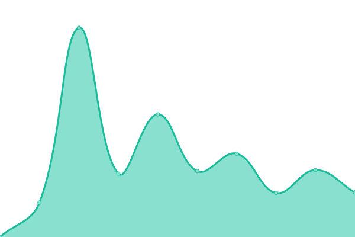
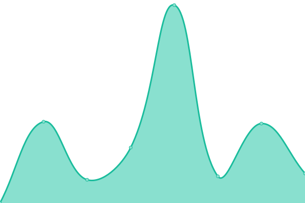

# [📈 Live Status](https://uab-dtic.github.io/guacamole-uab-monitoring): <!--live status--> **🟧 Partial outage**

This repository contains the open-source uptime monitor and status page for [UAB-DTIC](https://uab-dtic.github.io/guacamole-uab-monitoring), powered by [Upptime](https://github.com/upptime/upptime).

With [Upptime](https://upptime.js.org), you can get your own unlimited and free uptime monitor and status page, powered entirely by a GitHub repository. We use [Issues](https://github.com/uab-dtic/guacamole-uab-monitoring/issues) as incident reports, [Actions](https://github.com/uab-dtic/guacamole-uab-monitoring/actions) as uptime monitors, and [Pages](https://uab-dtic.github.io/guacamole-uab-monitoring) for the status page.

<!--start: status pages-->
<!-- This summary is generated by Upptime (https://github.com/upptime/upptime) -->
<!-- Do not edit this manually, your changes will be overwritten -->
<!-- prettier-ignore -->
| URL | Status | History | Response Time | Uptime |
| --- | ------ | ------- | ------------- | ------ |
|  [guaca-med](https://guacamed.uab.cat/guacamole/) | 🟩 Up | [guaca-med.yml](https://github.com/uab-dtic/guacamole-uab-monitoring/commits/HEAD/history/guaca-med.yml) | 

 4161ms
     
 | 

<a href="https://uab-dtic.github.io/guacamole-uab-monitoring/history/guaca-med">100.00%</a>
    

|  [guaca-cib](https://alvocatcib.uab.cat/guacamole/) | 🟩 Up | [guaca-cib.yml](https://github.com/uab-dtic/guacamole-uab-monitoring/commits/HEAD/history/guaca-cib.yml) | 

 3941ms
     
 | 

<a href="https://uab-dtic.github.io/guacamole-uab-monitoring/history/guaca-cib">99.94%</a>
    

|  [guaca-sbd](https://aules.sbd.uab.cat/guacamole/) | 🟩 Up | [guaca-sbd.yml](https://github.com/uab-dtic/guacamole-uab-monitoring/commits/HEAD/history/guaca-sbd.yml) | 

 4668ms
     
 | 

<a href="https://uab-dtic.github.io/guacamole-uab-monitoring/history/guaca-sbd">87.31%</a>
    

|  [guaca-fti](https://serim-guacamole.uab.cat/guacamole/) | 🟩 Up | [guaca-fti.yml](https://github.com/uab-dtic/guacamole-uab-monitoring/commits/HEAD/history/guaca-fti.yml) | 

 2688ms
     
 | 

<a href="https://uab-dtic.github.io/guacamole-uab-monitoring/history/guaca-fti">98.94%</a>
    

|  [guaca-eie](https://aules.fee.uab.cat/guacamole/) | 🟩 Up | [guaca-eie.yml](https://github.com/uab-dtic/guacamole-uab-monitoring/commits/HEAD/history/guaca-eie.yml) | 

 3743ms
     
 | 

<a href="https://uab-dtic.github.io/guacamole-uab-monitoring/history/guaca-eie">100.00%</a>
    

|  [guaca-vet](https://guacavet.uab.cat/guacamole/) | 🟩 Up | [guaca-vet.yml](https://github.com/uab-dtic/guacamole-uab-monitoring/commits/HEAD/history/guaca-vet.yml) | 

 2771ms
     
 | 

<a href="https://uab-dtic.github.io/guacamole-uab-monitoring/history/guaca-vet">98.78%</a>
    

|  [guaca-cc](https://alvocatcc.uab.cat/guacamole/) | 🟥 Down | [guaca-cc.yml](https://github.com/uab-dtic/guacamole-uab-monitoring/commits/HEAD/history/guaca-cc.yml) | 

 0ms
     
 | 

<a href="https://uab-dtic.github.io/guacamole-uab-monitoring/history/guaca-cc">0.00%</a>
    

|  [guaca-ee](https://aperture.uab.cat/guacamole/) | 🟩 Up | [guaca-ee.yml](https://github.com/uab-dtic/guacamole-uab-monitoring/commits/HEAD/history/guaca-ee.yml) | 

 1148ms
     
 | 

<a href="https://uab-dtic.github.io/guacamole-uab-monitoring/history/guaca-ee">100.00%</a>
    

|  [guaca-soc](https://aules.ccss.uab.cat/guacamole/) | 🟩 Up | [guaca-soc.yml](https://github.com/uab-dtic/guacamole-uab-monitoring/commits/HEAD/history/guaca-soc.yml) | 

 2123ms
     
 | 

<a href="https://uab-dtic.github.io/guacamole-uab-monitoring/history/guaca-soc">100.00%</a>
    

|  [guaca-edu](https://guacaedu.uab.cat/guacamole/) | 🟩 Up | [guaca-edu.yml](https://github.com/uab-dtic/guacamole-uab-monitoring/commits/HEAD/history/guaca-edu.yml) | 

 1434ms
     
 | 

<a href="https://uab-dtic.github.io/guacamole-uab-monitoring/history/guaca-edu">100.00%</a>
    

|  [guaca-llet](https://guacallet.uab.cat/guacamole/) | 🟩 Up | [guaca-llet.yml](https://github.com/uab-dtic/guacamole-uab-monitoring/commits/HEAD/history/guaca-llet.yml) | 

 1240ms
     
 | 

<a href="https://uab-dtic.github.io/guacamole-uab-monitoring/history/guaca-llet">99.93%</a>
    

|  [guaca-psico](https://guacapsico.uab.cat/guacamole/) | 🟩 Up | [guaca-psico.yml](https://github.com/uab-dtic/guacamole-uab-monitoring/commits/HEAD/history/guaca-psico.yml) | 

 2873ms
     
 | 

<a href="https://uab-dtic.github.io/guacamole-uab-monitoring/history/guaca-psico">99.94%</a>
    

|  [guaca-liam](https://aules.liam.uab.cat/guacamole/) | 🟩 Up | [guaca-liam.yml](https://github.com/uab-dtic/guacamole-uab-monitoring/commits/HEAD/history/guaca-liam.yml) | 

 1962ms
     
 | 

<a href="https://uab-dtic.github.io/guacamole-uab-monitoring/history/guaca-liam">100.00%</a>
    

<!--end: status pages-->

[**Visit our status website →**](https://uab-dtic.github.io/guacamole-uab-monitoring)

## 📄 License

- Powered by: [Upptime](https://github.com/upptime/upptime)
- Code: [MIT](./LICENSE) © [UAB-DTIC](https://uab-dtic.github.io/guacamole-uab-monitoring)
- Data in the `./history` directory: [Open Database License](https://opendatacommons.org/licenses/odbl/1-0/)
